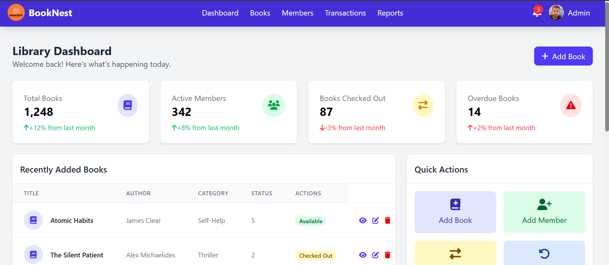
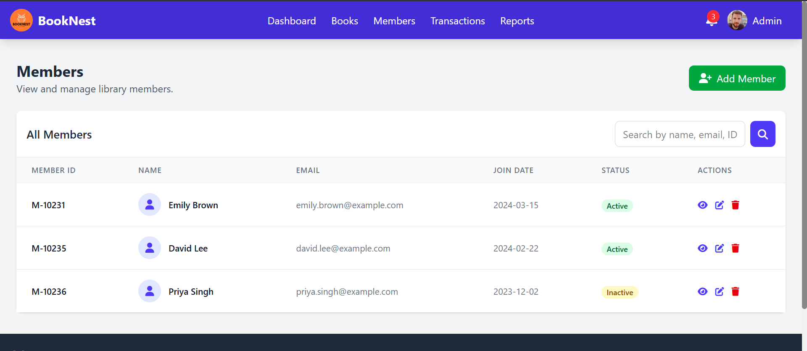

# 📚 BookNest: Smart Library Management Web Application

Welcome to **BookNest**, your next-generation solution for seamless library management! Designed for modern libraries, BookNest leverages React, TypeScript, Redux Toolkit, and Vite to deliver a blazing-fast, intuitive, and feature-rich experience for both librarians and members.

---

## 🚀 Features at a Glance

- **Book Inventory Management:** Add, update, categorize, and track books in your library.
- **Member Management:** Register, update, and manage members, including activity and borrowing history.
- **Borrowing & Transactions:** Handle book checkouts, returns, overdue tracking, and fines with ease.
- **Dynamic Reporting:** Gain insights with dashboard stats, category summaries, and member activity reports.
- **PDF Report Downloading:** Export library reports as professionally formatted PDFs for sharing or archival.
- **Email Notifications (via SendGrid):**
  - **Forgot Password:** Members can reset their passwords via secure email links.
  - **Welcome Emails:** New users automatically receive a registration confirmation and onboarding instructions.
- **Instant Search & Filtering:** Quickly find books and members with responsive search and smart filters.
- **Mock API Ready:** Easily switch between demo/mock data and real backend APIs.
- **Modern UI/UX:** Built with React + Vite for fast loading, smooth navigation, and mobile responsiveness.

---

## 🖼️ App Previews

See BookNest in action:


*Library Dashboard with statistics and quick actions*


*Member management with search and status*


*Comprehensive reports with PDF downloading capabilities*


*Transactions management with member and book details*

---

## 🏗️ Tech Stack

- **Frontend:** React, TypeScript, Vite
- **State Management:** Redux Toolkit
- **Styling:** Tailwind CSS
- **API Integration:** Axios (JWT-ready)
- **PDF Generation:** [jsPDF](https://github.com/parallax/jsPDF)
- **Email Integration:** SendGrid (for transactional emails)
- **Linting:** ESLint with React and TypeScript plugins

---

## ⚙️ Getting Started

### 1. Clone the Repository

```bash
git clone https://github.com/VihangaHesha/Smart-Library-Management-Web-Application.git
cd Smart-Library-Management-Web-Application
```

### 2. Install Dependencies

```bash
npm install
```

### 3. Run the App

```bash
npm run dev
```
Visit [http://localhost:5173](http://localhost:5173) to see BookNest in action!

---

## 🔒 Authentication & Email

- **Password Reset:** Members can initiate password resets; the app will trigger a secure, time-limited email with reset instructions via SendGrid.
- **Welcome Emails:** Upon registration, new users receive a welcome email with their login details (powered by SendGrid).
- Configure your SendGrid API key and email templates in the environment variables and backend/email service.

---

## 📝 PDF Reports

- Export dashboard, books, transactions, or member activity reports to PDF in one click.
- Professional formatting out-of-the-box.
- Built with extensibility in mind for custom templates.

---

## 📦 Folder Structure

```
src/
  ├─ slices/         # Redux slices (books, members, transactions, reports)
  ├─ store/          # Redux store setup
  ├─ api.ts          # Axios API config with JWT & email support
  ├─ reports/        # PDF generation utilities and components
  ├─ assets/         # App logos and images
  └─ main.tsx        # App entry point
```

---

## 🧩 Customization & Extensibility

- Swap out mock data for real API calls in Redux slices when you go to production.
- Easily integrate your SMTP/email provider for notifications.
- Add more PDF templates for new report types.
- Style with Tailwind or your favorite CSS framework.

---

## 🌱 Roadmap Ideas

- Advanced analytics dashboard with charts
- Role-based access (admin, staff, member)
- Integrate barcode/QR scanning for books
- Dark mode and theme support
- Push notifications for reservations and returns

---

## 🤝 Contributing

Pull requests are welcome! For major changes, open an issue first to discuss what you’d like to change.

---

## 📄 License

MIT

---

> _Empowering libraries, one click at a time._  
> — The BookNest Team
